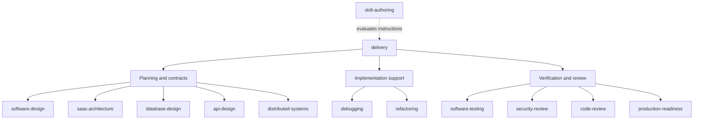
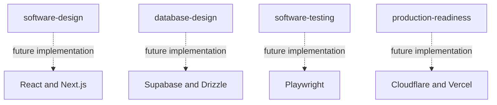

# Engineering skill system

## Goal and origin

Maintain one canonical, portable collection that helps coding agents apply engineering judgment consistently during planning, implementation, verification and review. The value is actionable decisions and observable checks, not teaching general concepts through long book summaries.

The discussion began with whether technical books such as Tod Golding's *Building Multi-Tenant SaaS Architectures* should become skills. The chosen approach is to synthesize decision frameworks, failure cases, implementation criteria and checklists from inspected sources, with deeper references loaded only when relevant. Several sources may inform one discipline; one book does not need its own overlapping skill.

The user's existing `delivery` is the orchestrator. Preserve `Horizon -> Outcome plan -> Vertical feature -> Task`, canonical feature records, dependencies, WIP, ownership, handoffs, planning maturity and rollout independent of completion. The user requested one PR containing the complete agnostic collection and delivery integration, not staged PRs. Technology-specific skills are explicitly outside this change.

## Responsibilities

| Capability | Owns | Does not own |
| --- | --- | --- |
| delivery | Workflow state, approved scope, sequencing, ownership, evidence links and rollout gates | Every discipline's method or automatic delegation |
| software-design | Domain vocabulary, module boundaries, complexity and dependency decisions | A mandatory class/layer architecture |
| saas-architecture | Tenant identity, isolation, lifecycle, metering and fairness | A particular provider or datastore |
| database-design | Data invariants, access patterns, concurrency and migrations | An ORM's API conventions |
| api-design | Consumer contracts, compatibility, errors and retry semantics | A framework's routing syntax |
| distributed-systems | Cross-process guarantees, partial failure, ordering and reconciliation | Unnecessary services or infrastructure |
| software-testing | Risk-to-check mapping, test adequacy and observed evidence | One tool or universal test-first mandate |
| security-review | Trust boundaries, scoped findings and negative checks | Certification or unrestricted live exploitation |
| code-review | Candidate-specific review, severity and finding closure | Automatic posting, approval or merge |
| production-readiness | Operational evidence, recovery and readiness verdict | Release authorization or deployment |
| debugging | Reproduction, evidence and bounded hypotheses | Unrequested fixes during diagnosis |
| refactoring | Behavior-preserving structural improvement | Silent semantic/data changes |
| skill-authoring | Focused instructions, provenance and behavioral evaluation | Automatic installation or copied book libraries |

The existing Apple HIG and OpenGraph skills remain their own design capabilities.

E2E strategy belongs to software-testing; migration safety belongs to database-design, with operational recovery assessed by production-readiness. Separate agnostic E2E/migration skills are not needed until a distinct reusable procedure warrants them. A future Playwright skill implements browser checks without replacing the test strategy.

## Composition diagram

Arrows show contributions selected for an affected boundary, not a mandatory execution sequence or installation dependency. Feedback from implementation constraints can revise an earlier decision.

The final architecture also allows optional technology capabilities. They are documented here as future direction, not added or installed by this PR:

TypeScript and GitHub Actions are additional future candidates. Technology skills verify the project's actual version/configuration and translate decisions into supported mechanisms. A provider limitation can require revisiting a decision; agnosticism does not mean ignoring constraints.

## Delivery integration

Use the routing reference only for material uncertainty or a configured verification/review boundary. A punctuation change does not need an architecture audit; a small tenant-authorization diff may need substantial negative testing.

Plans identify real affected files, consumed/produced contracts and acceptance-to-task-to-check coverage. They do not contain an entire speculative implementation. Templates may contain placeholders, but approved executable steps cannot hide material unknowns behind TODO/TBD. Existing approved/completed records do not lose their state because optional new headings are absent.

Specialists return decisions, findings, evidence and limitations to the canonical feature. They do not create competing trackers. Missing optional skills trigger a disclosed direct fallback, not automatic installation; a genuine missing evidence/expertise gate is reported specifically.

Completion records distinguish planned checks, executed results, candidate revisions, environments and review types. Changed behavior invalidates affected old evidence; unchanged evidence can be reused explicitly. Self-review, independent agent review and human approval are separate. Readiness can be assessed while exposure remains gated.

## Source strategy

| Source | Decision | Adaptation and exclusions |
| --- | --- | --- |
| Superpowers writing-plans | Adapt | File/contract maps and coverage checks within existing delivery records; exclude its plan hierarchy, mandatory full-code plans and fixed step durations |
| Superpowers verification/review | Adapt | Candidate-specific evidence and review closure; exclude automatic dispatch/posting and redundant universal pauses |
| Superpowers TDD | Adapt | Regression-first and test-first where useful; exclude deleting existing implementation or mandatory TDD for every change |
| Superpowers systematic-debugging | Adapt | Evidence and hypotheses; exclude secret-dumping examples, arbitrary attempt counts and diagnosis-to-fix scope expansion |
| Superpowers writing-skills | Adapt | Independent baseline/skill cases and separate rubrics |
| WondelAI clean-architecture, DDD, software-design-philosophy, pragmatic-programmer | Consolidate | Contextual boundary/complexity decisions in software-design; exclude numeric scores and universal object-oriented prescriptions |
| WondelAI ddia-systems | Consolidate | Data/concurrency in database-design; cross-process guarantees in distributed-systems |
| WondelAI release-it | Consolidate | Failure reasoning in distributed-systems; operational evidence in production-readiness |
| WondelAI refactoring-patterns | Adapt | Behavior-preserving transformations in refactoring |
| WondelAI design-code-architecture | Reference only | Reviewed the orchestration idea; do not import a second tracker or its approval-at-every-phase workflow |
| Other upstream skills, including clean-code/system-design | Defer | No bulk import; retain only reviewed criteria needed by the selected disciplines |
| OWASP official authorization/REST guidance | Reference | Scoped security/API criteria, without vendoring the manuals |
| Golding's multi-tenant SaaS book | Pending source analysis | Motivation, not a claim that its chapters were read or faithfully converted |

Pinned source revisions, inspected paths, deliberate departures and full applicable MIT notices live inside each adapted skill's `references/sources.md`, so selective installation retains provenance. This is a selective adaptation, not a mirror of either upstream repository. No automatic upstream updates or third-party executable code were imported.

Vercel's agent-skills, Anthony Fu's skills and Anthropic's skills were discussed as additional format/technology references. They are not imported or represented as reviewed implementations in this change. Future adoption requires the same source and compatibility review.

## Quality model and enforceable controls

The intended workflow combines `AGENTS.md`/`CLAUDE.md` repository guidance, focused skills, unit/integration/API/contract/E2E checks where useful, automated review and final human review under project policy. Skills can help identify needed branch protections, access controls, migration-only data changes, backups, and separated development/staging/production environments. Those controls must be enforced by the actual platform and credentials; Markdown alone is not enforcement.

Keep skill descriptions discriminating, bodies concise, and references local and conditional. Preserve one canonical copy under `skills/`, automatic discovery by default, and optional independent installation. Do not introduce technology mandates into methodology/domain skills.

## Validation and continuation

Structural validation checks metadata, links, portable resources, manifests, scenario shape and fixture containment. It does not execute an agent. See [evaluation protocol](evaluation-protocol.md) for preparing blind cases and [initial evidence](evaluations/agnostic-skills.md) for the runs actually performed and their limitations.

The agnostic collection and delivery changes ship together in one reviewable PR. Human review and merge remain separate actions. Future sessions should read this document, the PR description, source mappings, current diff and evidence before extending the system. Add technology capabilities only in a subsequently authorized change. Analyze the book directly before adding book-specific attributions. Revisit skills based on demonstrated failures and reviewed source updates, not instruction count.
